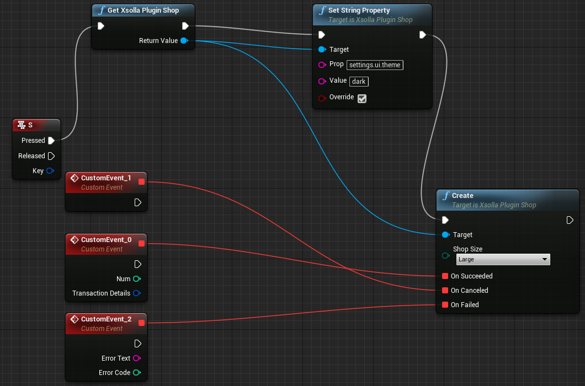
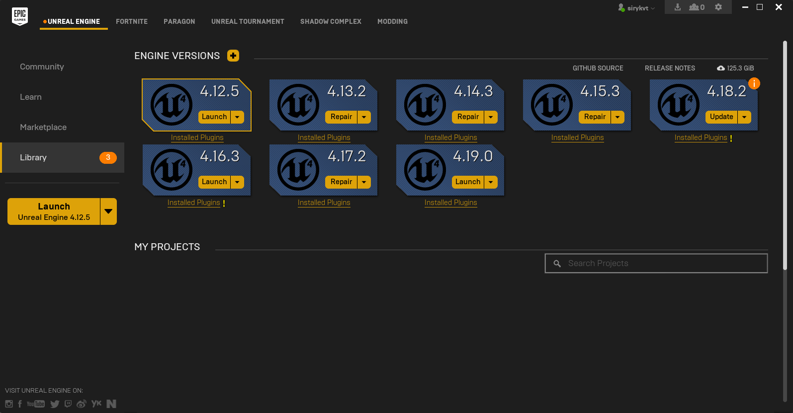

# Xsolla Plugin

### Download with prebuilt binaries
Engine version: 

* [4.18 Win64](https://bitbucket.org/sirykvt/xsollaplugin/downloads/XsollaPlugin-4.18.zip)

* [4.19 Win64](https://bitbucket.org/sirykvt/xsollaplugin/downloads/XsollaPlugin-4.19.zip)

### Install 
Unpack downloaded archive to `{YourProject}/Plugins/`. Create folder, if not exists.

### Setting up
Open plugin settings `Setting > Project Settings > Xsolla`, then set `Server Url`, `Integration Type` and `Project Id`. If you want to use shop in sandbox mode, check `Sandbox Mode` checkbox. 

### Setting up server
#### Dependencies
[NodeJS 8](https://nodejs.org)

#### Configure
Go to the `Server` folder. Execute the following in console:

`$ npm init`

`# npm install pm2 -g` - needed for start server as daemon

#### Start
`$ npm run-script start`

#### Stop
`$ npm run-script stop`

### How to use in blueprint
`Xsolla Plugin BP Library` has 5 blueprint function.
* `CreateXsollaShop` - Gets shop token, set default properties and creates widget with shop content. Takes shop size and delegates for payment succeeded|canceled|failed as parameters. 
* `CreateXsollaShopWithToken` - Creates shop widget content based on token. Takes shop size, external id, token and delegates for payment succeeded|canceled|failed as parameters. 
* `Set(Num|Bool|String)Property` - Set properties in json, which is sent as token parameters, see [token](https://developers.xsolla.com/ru/api_v2.html#token). Should be called before `CreateXsollaShop` or `CreateXsollaShopWithToken` function.

### Example


### How to use in c++
#### Visual Studio
1. Generate project files *(right click on yourproject.uproject > Generate Visual Studio project files)*.
2. Add `XsollaPlugin` to the `ExtraModuleNames` in `YourProject.Target.cs` and `YourProjectEditor.Target.cs`.
3. Add `XsollaPlugin` to the `PublicDependencyModuleNames` or `PrivateDependencyModuleNames` in `YourModule.Build.cs`*(module where you want to use the plugin)*.
3. Include `XsollaPlugin.h`.
4. Call `XsollaPlugin::GetShop()->Create(EShopSizeEnum::VE_Large, FString("userid"), OnSucceeded, OnCanceled, OnFailed);` 
Shop size can be `EShopSizeEnum::VE_Large`, `EShopSizeEnum::VE_Medium`, `EShopSizeEnum::VE_Small`.

Code example
```c++
---------------- HEADER -----------------
...

    UFUNCTION(BlueprintCallable)
    void OnSucceededCallback(FTransactionDetails transactionDetails);

    UFUNCTION(BlueprintCallable)
    void OnCanceledCallback();

    UFUNCTION(BlueprintCallable)
    void OnFailedCallback(FString errorText);

protected:
    // Called when the game starts or when spawned
    virtual void BeginPlay() override;
    
...
```

```c++
---------------- SOURCE -----------------
...

// Called when the game starts or when spawned
void AMyActor::BeginPlay()
{
    Super::BeginPlay();

    FOnPaymantSucceeded OnSucceeded;
    FOnPaymantCanceled OnCanceled;
    FOnPaymantFailed OnFailed;

    OnSucceeded.BindUFunction(this, "OnSucceededCallback");
    OnCanceled.BindUFunction(this, "OnCanceledCallback");
    OnFailed.BindUFunction(this, "OnFailedCallback");

    XsollaPlugin::GetShop()->Create(EShopSizeEnum::VE_Large, FString("exampleid"), OnSucceeded, OnCanceled, OnFailed);
    
}

void AMyActor::OnSucceededCallback(FTransactionDetails transactionDetails)
{
    UE_LOG(LogTemp, Warning, TEXT("Payment succeded. Transaction id: %d"), transactionDetails.TransactionId);
}

void AMyActor::OnCanceledCallback()
{
    UE_LOG(LogTemp, Warning, TEXT("Payment canceled"));
}

void AMyActor::OnFailedCallback(FString errorText)
{
    UE_LOG(LogTemp, Warning, TEXT("Payment failed. Error text: %s"), *errorText);
}

...
```

### How to create Unreal Engine project
1. Sign up and download launcher from [off site](https://www.unrealengine.com) 
2. Install and launch engine at UNREAL ENGINE -> Library

3. In opened project browser you can create code (c++) or non-code (blueprint) project
