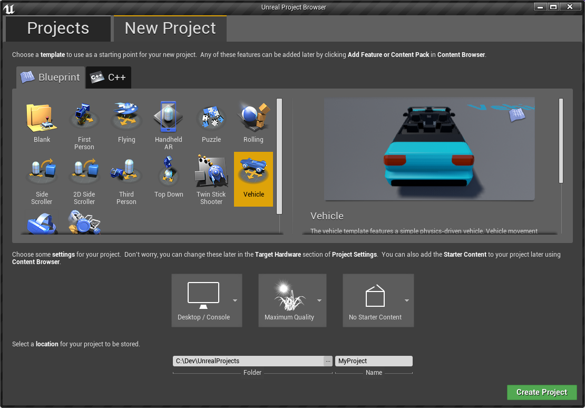

# Xsolla Plugin

### Example project
* [Win64](https://drive.google.com/open?id=1Yq1li5H7MsMGJxPQl3DlAKaoJ4GM2X7i)

### Download with prebuilt binaries

### Install 
Unpack downloaded archive to `{YourProject}/Plugins/`. Create folder, if not exists.

### Setting up
Open plugin settings `Setting > Project Settings > Xsolla PayStation`, then set `Server Url`, check `Sandbox Mode` checkbox. Server example for server integration located in `/Server` folder.

### How to use in blueprint
`Xsolla Plugin BP Library` has 5 blueprint function.

* `CreateXsollaShop` - Gets shop token, set default properties and creates widget with shop content. Takes shop size and delegates for payment succeeded|canceled|failed as parameters. 

### Example


### How to use in c++
#### Visual Studio
1. Generate project files *(right click on yourproject.uproject > Generate Visual Studio project files)*.
2. Add `XsollaPlugin` to the `ExtraModuleNames` in `YourProject.Target.cs` and `YourProjectEditor.Target.cs`.
3. Add `XsollaPlugin` to the `PublicDependencyModuleNames` or `PrivateDependencyModuleNames` in `YourModule.Build.cs`*(module where you want to use the plugin)*.
3. Include `XsollaPlugin.h`.
4. Call `XsollaPayStationPlugin::Get()->Create(EShopSizeEnum::VE_Large, FString("userid"), OnShopClosed);` 
Shop size can be `EShopSizeEnum::VE_Large`, `EShopSizeEnum::VE_Medium`, `EShopSizeEnum::VE_Small`.

Code example
```c++
---------------- HEADER -----------------
...

    UFUNCTION(BlueprintCallable)
    void OnPayStationClosedCallback();

protected:
    // Called when the game starts or when spawned
    virtual void BeginPlay() override;
    
...
```

```c++
---------------- SOURCE -----------------
...

// Called when the game starts or when spawned
void AMyActor::BeginPlay()
{
    Super::BeginPlay();

    FOnPaymantSucceeded OnPayStationClosedCallback;
    OnPayStationClosedCallback.BindUFunction(this, "OnPayStationClosedCallback");

    XsollaPayStationPlugin::Get()->Create(EShopSizeEnum::VE_Large, FString("exampleid"), OnPayStationClosedCallback);
    
}

void AMyActor::OnPayStationClosedCallback()
{
    UE_LOG(LogTemp, Warning, TEXT(""));
}

...
```

### Setting up server
#### Dependencies
[NodeJS 8](https://nodejs.org)

#### Configure
Go to the `Server` folder. Execute the following in console:

`$ npm init`

`# npm install pm2 -g` - needed for start server as daemon

#### Start
`$ npm run-script start`

#### Stop
`$ npm run-script stop`

### How to create Unreal Engine project
1. Sign up and download launcher from [here](https://www.unrealengine.com).
2. Install and launch engine at UNREAL ENGINE -> Library.

3. In opened project browser you can create code (c++) or non-code (blueprint) project.
