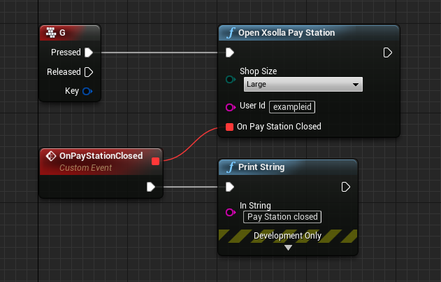

# Pay Station UE4 SDK

### Introduction
Pay Station UE4 SDK is used to integrate the Xsolla payment interface with apps based on Unreal Engine.

See demo:

* [For Windows](http://livedemo.xsolla.com/ue4/PayStation-Win.zip)

* [For Mac OS](http://livedemo.xsolla.com/ue4/PayStation-Mac.zip)

### System Requirements
* 64-bit OS

* Windows 10

* Mac OS X 10.11 and higher

* Visual Studio 2017

* Unreal Engine v4.19 and higher

### Integration Flow
1. Register an [Xsolla Publisher Account](https://publisher.xsolla.com/).
2. Create a project in your Publisher Account. 
3. Get a token.
4. Set up webhooks.
5. Install and set up the plugin for the Unreal Engine project.

For integration you will need the following parameters:

* `merchantId` – ID of a merchant, shown in Project settings > Webhooks.

* `apiKey` – API key. Parameter is generated in the Company settings > API key section

* `projectId` – ID of the project, shown in Project settings > Webhooks

* `projectSecretKey` – A secret key of the project. Parameter is generated in the Project settings > Webhooks section

### Creating a Project

1. Log in to Publisher Account.
2. Go to Projects and click Create new project.
3. In project settings:
    * Specify the webhook URL
    * Generate a secret key to sign project webhooks

### Getting a Token

For the SDK to work properly, you need to obtain a token. An access token is a string that is used to authorize client’s requests to the server.

Xsolla API uses [Basic HTTP authentication](https://developers.xsolla.com/ru/api/v2/getting-started/#api_authentication). Specify your merchant ID as the username and your API key as the password.

URL to retrieve the token:

https://api.xsolla.com/merchant/v2/merchants/{merchant_id}/token

You can alter the HTTP POST request by including the parameters you want to pass on to the payment interface. Both the request and response are in the JSON format.

An example with CURL:

```
curl -v https://api.xsolla.com/merchant/v2/merchants/{merchant_id}/token \
-X POST \
-u your_merchant_id:merchant_api_key \
-H 'Content-Type:application/json' \
-H 'Accept: application/json' \
-d '
{
    "user": {
        "id": {
            "value": "1234567"
        },
        "email": {
            "value": "email@example.com"
        }
    },
    "settings": {
        "project_id": 14004,
        "mode": "sandbox"
    },
    "purchase": {
        "checkout": {
            "amount": 9.99,
            "currency": "USD"
        }
    }
}'
```

You can find the full list of parameters in the [API Reference](https://developers.xsolla.com/ru/api/v2/getting-started/#api_payment_ui_get_token).

### Setting up Webhooks

You need to implement the following webhooks:

   * [User validation](https://developers.xsolla.com/api/v2/getting-started/#api_webhooks_user_validation)
    
   * [Payment](https://developers.xsolla.com/api/v2/getting-started/#api_webhooks_payment)
    
   * [Refund](https://developers.xsolla.com/api/v2/getting-started/#api_webhooks_refund)

To confirm the receipt of a webhook, your server will respond with HTTP code 204 without a message body. You can read more about webhooks, including examples, in the [API Reference](https://developers.xsolla.com/api/v2/getting-started/#api_webhooks_refund).

To test webhooks, open Project settings > Webhooks section.

### Installing and Setting up the Plugin

1. Run the [Epic Games Launcher](https://www.epicgames.com/unrealtournament/download), go to **My projects** and select a project for which you want to add the plugin.
2. [Download the plugin](https://github.com/xsolla/PayStation-UE4-SDK/releases).
3. Unpack the archive into the **{YourProject}/Plugins/** folder. If there is no **Plugins** folder, create it.
4. Open the plugin settings: Settings > Project Settings > Xsolla Pay Station.
5. Specify the **Server URL** parameter, which is the URL for getting a token. You can use the (https://livedemo.xsolla.com/paystation/token_unreal.php) URL for testing.

```
Note: To open the payment interface in the sandbox mode, please tick the Sandbox mode checkbox and pass settings.mode: sandbox in the Get token request. 
```

### Usage
### Setting up a C++ Project
```
Note: To set up your project, use Visual Studio for Windows or Xcode for Mac OS
```

1. Generate project files by choosing in your project context menu:
    * `Generate Visual Studio project files` – for Windows,
    * `Open Xcode` – for Mac OS.
2. Add `XsollaPayStationPlugin` into `ExtraModuleNames` in the {YourProject}.Target.cs and {YourProjectEditor}.Target.cs files.
3. Add `XsollaPayStationPlugin` into `PublicDependencyModuleNames` or into `PrivateDependencyModuleNames` in the {YourModule}.Build.cs file.
4. Include the XsollaPayStationPlugin.h file.
5. Set up the opening of the payment interface by using the `XsollaPayStationPlugin::Get()->Create()` function. Specify the following parameters:
    * `EShopSizeEnum` - the interface size. Available sizes: VE_Small – 620 x 630, VE_Medium – 740 x 760, and VE_Large – 820 x 840.
    * `userid` – in-game user ID.
    * `OnShopClosed()` – activating a callback function upon closing Pay Station.

After calling the `XsollaPayStationPlugin::Get()->Create()` function, the plugin:
    1. Sends a request to the server using the URL from the project settings in the `Get Token URL` parameter. User ID and Sandbox mode indicator are passed in the request.
    2. Receives a token in the server response and opens the payment interface.

`Code example:`

```
---------------- HEADER -----------------
...

UFUNCTION(BlueprintCallable)
void OnPayStationClosedCallback();

protected:
// Called when the game starts or when spawned
virtual void BeginPlay() override;

...
```
```
---------------- SOURCE -----------------
...

// Called when the game starts or when spawned
void AMyActor::BeginPlay()
{
Super::BeginPlay();

FOnPaymantSucceeded OnPayStationClosedCallback;
OnPayStationClosedCallback.BindUFunction(this, "OnPayStationClosedCallback");

XsollaPayStationPlugin::Get()->Create(EShopSizeEnum::VE_Large, userid("exampleid"), OnPayStationClosedCallback);

}

void AMyActor::OnPayStationClosedCallback()
{
UE_LOG(LogTemp, Warning, TEXT(""));
}

...
```
### Setting up a Blueprint Project

Set up the opening of the payment interface using the `Open Xsolla Pay Station` function. Specify the following parameters:

   * **Shop Size** – interface window size. Possible parameters: Small – 620 x 630, Medium – 740 x 760, and Large – 820 x 840.

   * **User id** – user ID. 

   * **On Pay Station Closed** – activating оf a callback function upon closing Pay Station.
    
After activating the `Open Xsolla Pay Station` function, the plugin:
    1. Sends a request to the server using the URL from the project settings in the `Server URL` parameter. User ID and Sandbox mode indicator are passed in the request.
    2. Receives a token in the server response and opens the payment interface.

`An example of a blueprint project with the opening of the payment interface:`


